# MIMOSA NODE JS REST-API

## Introduction

Mimosa is a publishing platform for open collaboration. Its core principles are as-you-go micro publishing, open science, open source and open feedback.
Mimosa is currently in *alpha version*, but the ideal finished product would look like this design prototype: https://projects.invisionapp.com/share/J7ZKYYBPGEB#/screens/436978924_home
This repository and its twin (frontend: https://github.com/Mimosa-Development-Team/mimosa-frontend) allow you to run the current version of Mimosa locally, so that you can host your own, or contribute by developing additiona functions.

Follow the Mimosa blog and learn more here: https://openmimosablog.wordpress.com/


### **NOTE**:
Setup and run backend first before running frontend application. 

### Installation 

## Setup Guide
- [Getting Started](#installation)

[](https://standardjs.com)

### Requirements

1. Node - Download and install Node.js in https://nodejs.org/en/download
  - Open Command Prompt (WINDOWS) or Terminal (LINUX and macOS)
  - Type `node -v` to check if it is installed. Output should be node version. 
2. Yarn 
- (LINUX or macOS) 
  - Open Terminal
  - type `npm install --global yarn` then enter
  - type `yarn -v` to check if yarn is installed. Output should be yarn version
- (Windows OS) 
  - Search d Prompt (CMD)
  - Right click on CMD and Run as Administrator
  - type `npm install --global yarn` then enter
  - type `yarn -v` to check if yarn is installed. Output should be yarn version
3. Git - Download and install Git in https://git-scm.com/downloads. 
  - Open Command Prompt (WINDOWS) or Terminal (LINUX and macOS)
  - Type `git --version` to check if it is installed. Output should be git version. 
  Note: For macOS you might need to install homebrew. Follow the installation tutorial at https://git-scm.com/download/mac.
4. Visual Studio Code - Download and install in https://code.visualstudio.com/download

### Installation and Setting up local development environment
Clone repository
1. Open Terminal
- (LINUX or macOS) 
  - Open Terminal
- (WINDOWS) 
  - Open Command Prompt (CMD)
2. Clone Repository. Type/Run command on your Terminal or CMD
```
git clone https://github.com/Mimosa-Development-Team/mimosa-backend.git && cd mimosa-backend
```
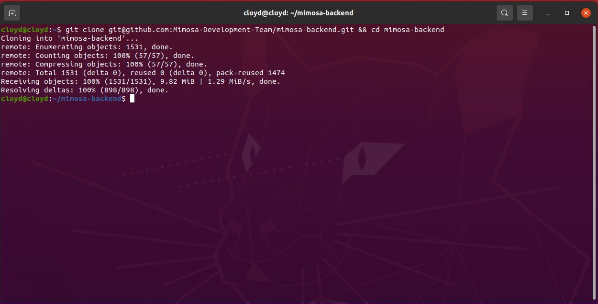
3. After Clone is done. Type on terminal
```
code .
```
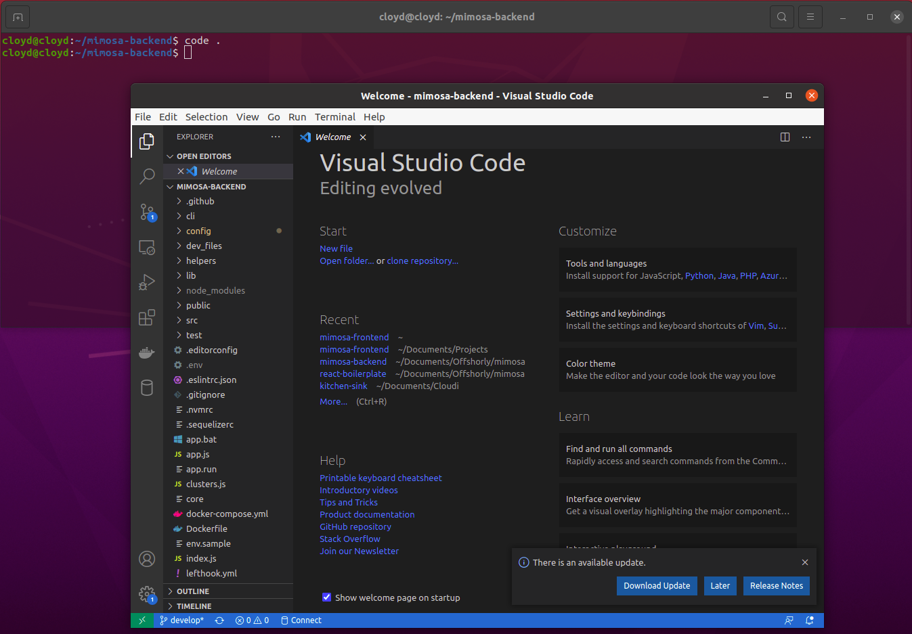
4. Visual Studio Code will open automatically.
- If Visual Studio Code didn't open.
    - Open Visual Studio Code
    - Find your Project `mimosa-backend` folder
    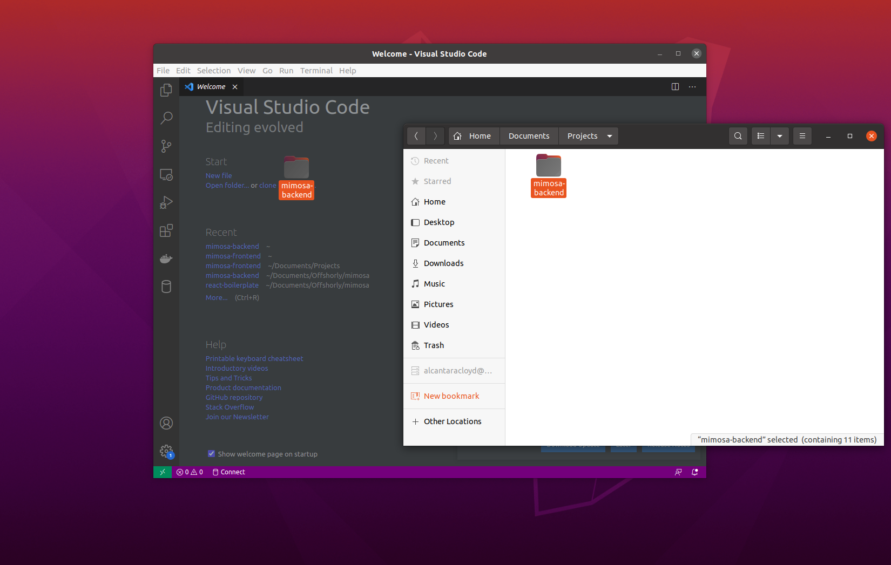
    - Drag Project folder to Visual Studio Code
5. On your Visual Studio Code. Click Terminal
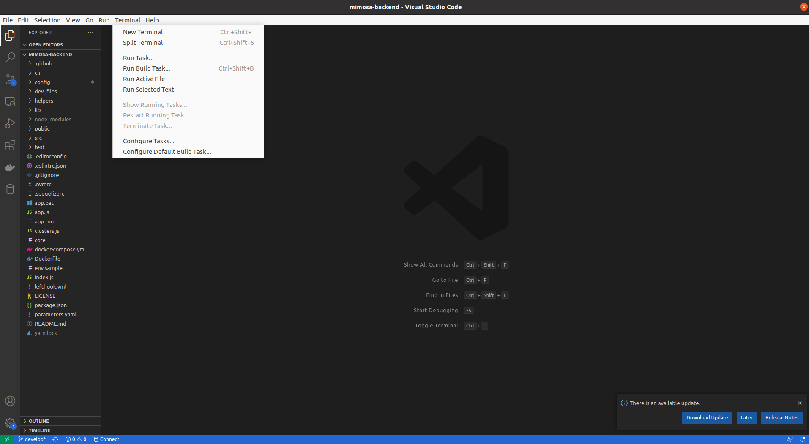


### Docker Installation and Setup
  Follow the  instruction on how to install Docker based on your Operation System:
- (LINUX/UBUNTU) 
  - https://docs.docker.com/engine/install/ubuntu
- (macOS) 
  - https://docs.docker.com/docker-for-mac/install
- (WINDOWS) 
  - https://docs.docker.com/docker-for-windows/install

  Note: For Windows, you might need to follow this instructions if you have a problem on virtualization.

  1. Press the Windows key to get the Search box.
  2. Type turn windows features on or off and click on it to open it.
  3. Scroll down and check the box next to Hyper-V.
  4. Click OK.
  5. Windows will install the necessary files to enable virtualization.
  6. You'll then be asked to reboot PC.
  7. And check your BIOS if still error. https://superuser.com/questions/568425/hyper-v-virtualisation-disabled-in-firmware

After Docker Installation:

- (WINDOWS and macOS) 
  - Start Docker Application
- Go back to Visual Studio Code
- Right click on `env.sample` and rename to `.env`
- Run Docker on mimosa-backend Project
  - **Recommended:** `docker-compose up -d`. Run command if you want to run the next code in your Visual Studio Code Terminal. Do not run the next command which is `docker-compose up` after you run this command.

  - `docker-compose up`. Run command if you want to open a new terminal/cmd  to run  the next code.

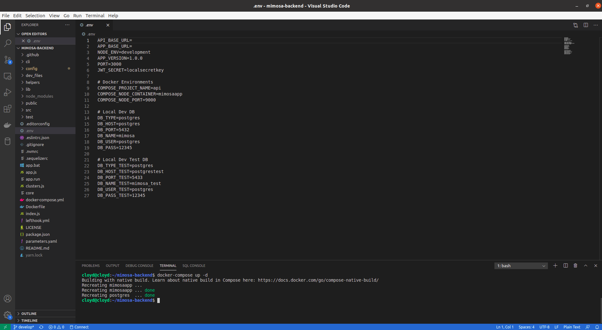

**Note**: If the `Dockerfile` or `docker-compose.yml` was updated you must append the `--build` flag
to the command. This will ensure that the Docker settings are all rebuild and applied to the container.
```
docker-compose up --build
```

#### Install Node Dependencies
Installing node modules should be run inside the docker container.


(LINUX or macOS)
```
./app.run yarn
```

(WINDOWS)
```
docker exec mimosaapp yarn
```

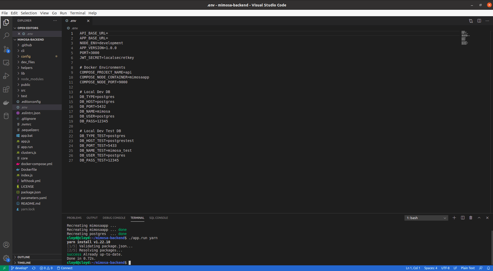

#### Local Configuration

On your Visual Studio Code. Open `config` folder and select `database.js` then change the existing code with this code then save.
```
const path = require('path')

/**
 * This is to ensure that the .env file is being parsed
 * when this config file is called via terminal
 */
require('dotenv').config({
  path: path.resolve('.env')
})

module.exports = {
  development: {
    username: process.env.DB_USER,
    password: process.env.DB_PASS,
    database: process.env.DB_NAME,
    host: process.env.DB_HOST,
    port: process.env.DB_PORT,
    dialect: process.env.DB_TYPE,
    define: {
      underscored: true
    },
    dialectOptions: {
      useUTC: true
    },
    timezone: '00:00' // --> for writing to database
  },
  test: {
    username: process.env.DB_USER_TEST,
    password: process.env.DB_PASS_TEST,
    database: process.env.DB_NAME_TEST,
    host: process.env.DB_HOST_TEST,
    port: process.env.DB_PORT_TEST,
    dialect: process.env.DB_TYPE_TEST,
    define: {
      underscored: true
    },
    dialectOptions: {
      useUTC: true // --> for reading from database
    },
    timezone: '00:00', // --> for writing to database,
    logging: false // remove logs
  },
  production: {
    username: process.env.DB_USER,
    password: process.env.DB_PASS,
    database: process.env.DB_NAME,
    host: process.env.DB_HOST,
    port: process.env.DB_PORT,
    dialect: process.env.DB_TYPE,
    define: {
      underscored: true
    },
    dialectOptions: {
      useUTC: true // --> for reading from database
    },
    timezone: '00:00' // --> for writing to database
  }
}
```
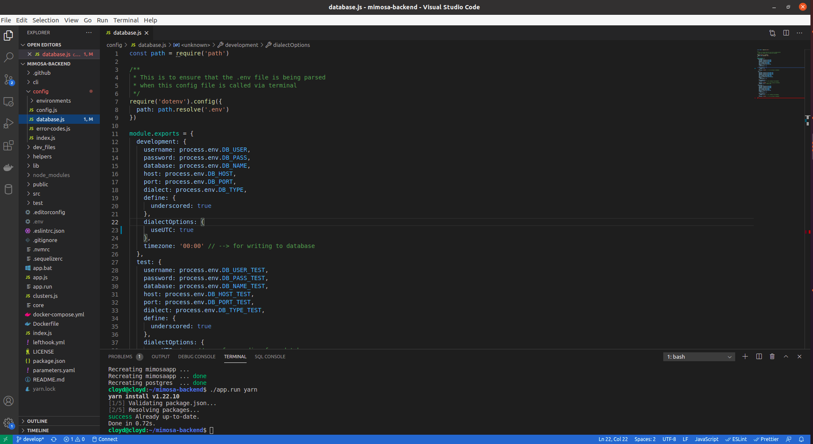

#### Sequelize CLI's

Run pending migrations

(WINDOWS)
```
docker exec mimosaapp yarn migrate
```

(LINUX or macOS)
```
./app.run yarn migrate
```

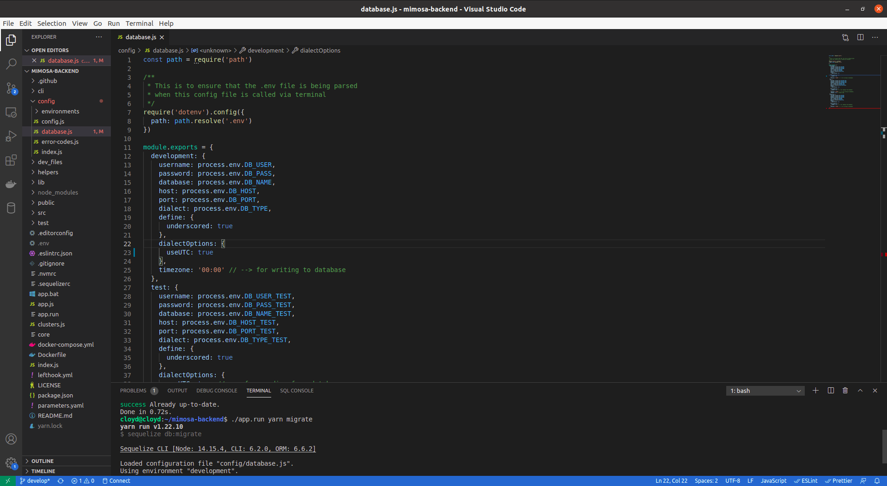

Run pending sp functions

(WINDOWS)
```
docker exec mimosaapp yarn migrate:sp
```

(LINUX or macOS)
```
./app.run yarn migrate:sp
```

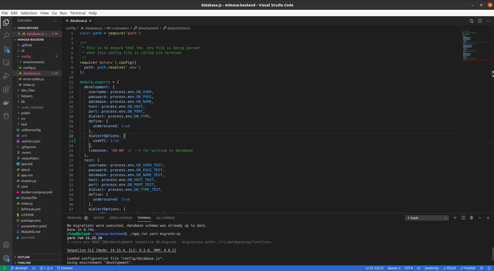

Run seeders

(WINDOWS)
```
docker exec mimosaapp yarn seed
```

(LINUX or macOS)
```
./app.run yarn seed
```

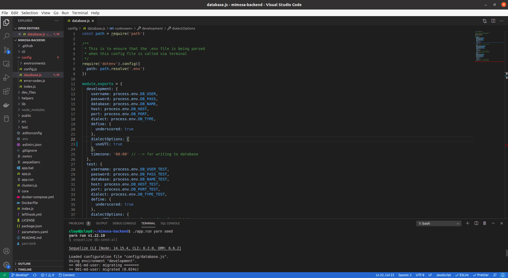

Start Application

(WINDOWS)
```
docker exec mimosaapp yarn start:dev
```

(LINUX or macOS)
```
./app.run yarn start:dev
```
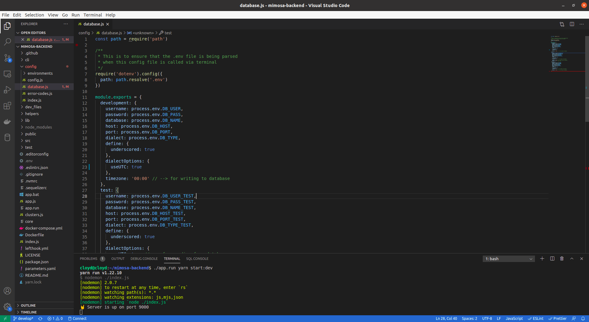


Run Migration Undo (If you have change on your database and postgres functions)

(WINDOWS)
```
docker exec mimosaapp yarn migrate:undo
```

(LINUX or macOS)
```
./app.run migrate:undo           Revert the last migration run.
```


#### Overview

- uses Node.js
- written using ES6
- uses Yarn for package dependency management
- uses JavaScript Standard Style
- uses `sequelize` and `sequelize-cli` as ORM and data migration tool
- uses Swagger as documentation, {URL}/docs
